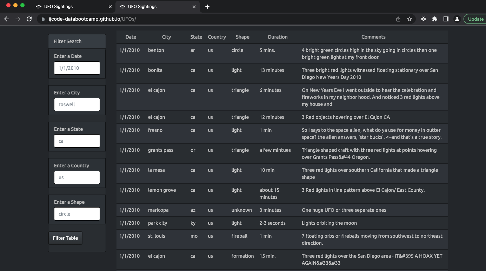

# UFOs

## Overview 

The goal of this project is to create a site that allows users to interact with the UFO data dynamically based on different input categories. The data was collected by Dana a data journalist who has been collecting and researching on this subject since the 1950s. 

This HTML site used javascript and bootstrap as the main components for formatting and dynamic interaction.

Site: https://jjcode-databootcamp.github.io/UFOs/

## Results
Users can use the different filters to input the values they are looking for based on the following categories. Capitalization does not matter. Based on the data filter users can look for correlations of the data manually. 

- date
- city
- state
- country 
- shape

## Summary 

The goal of this is to give user an overall idea of the data. The following can be done to help users explore the data further:

- trend analysis based on the filters 
- a reset button so users don't have to manually update filters 
- graphs to help visualize the data 

